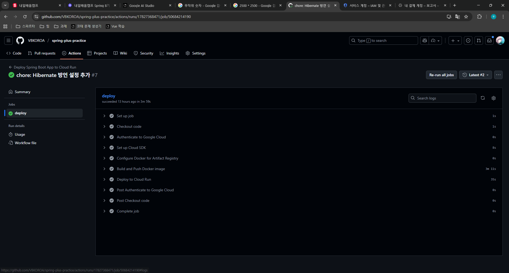
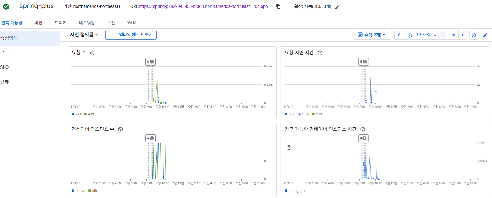

# SPRING PLUS
## AWS 연결

> _현재는 과금이 두려워 전부 삭제함_
## 대용량 데이터 처리
[노션 링크](https://www.notion.so/2709541fdc3080c980f1df8ef160a534?showMoveTo=true&saveParent=true)
## CI/CD

- AWS는 돈이 나가는 관계로 GCP에다가 구축함.